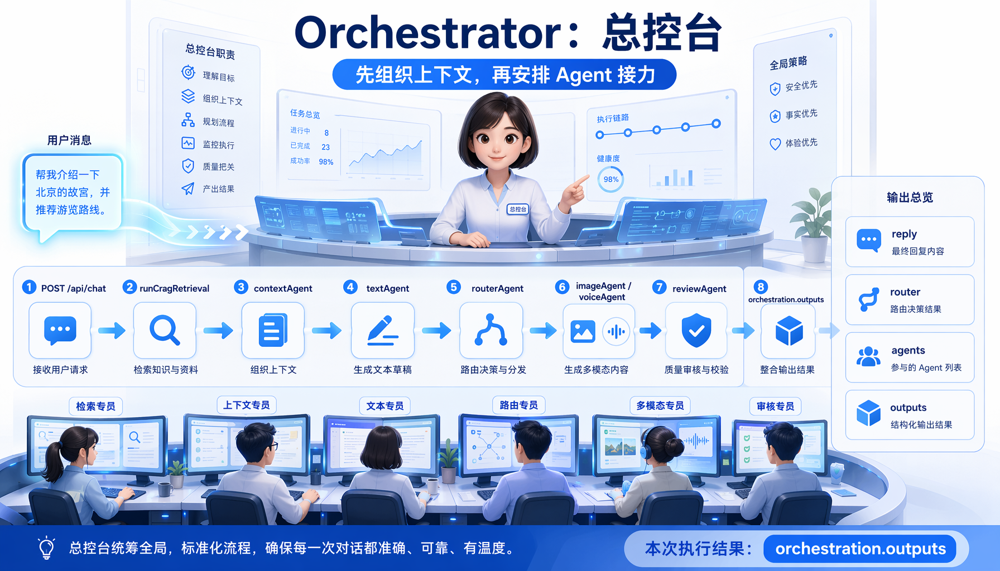
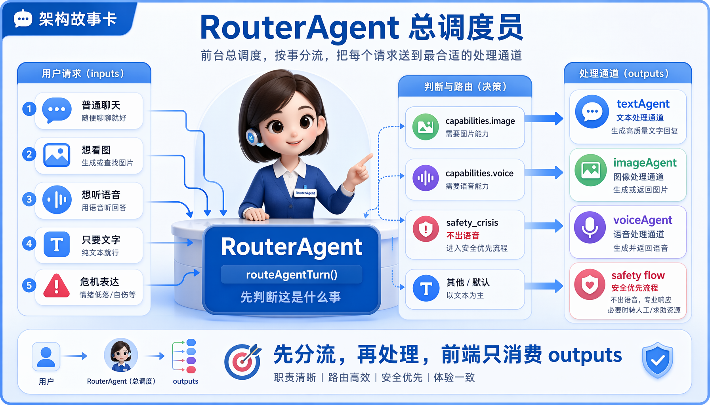
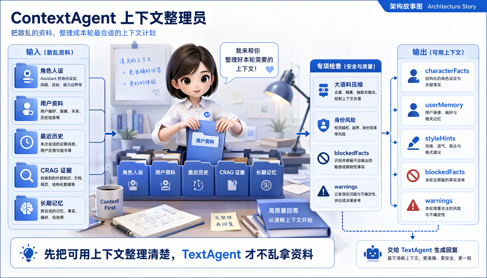
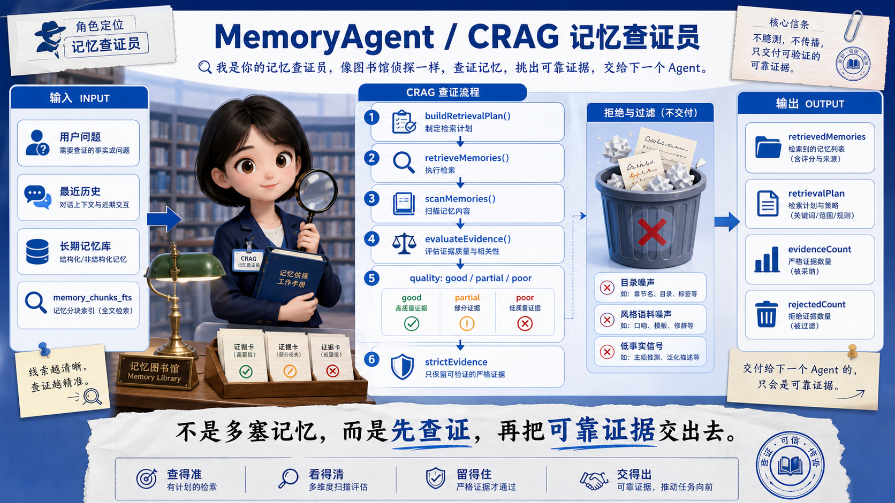
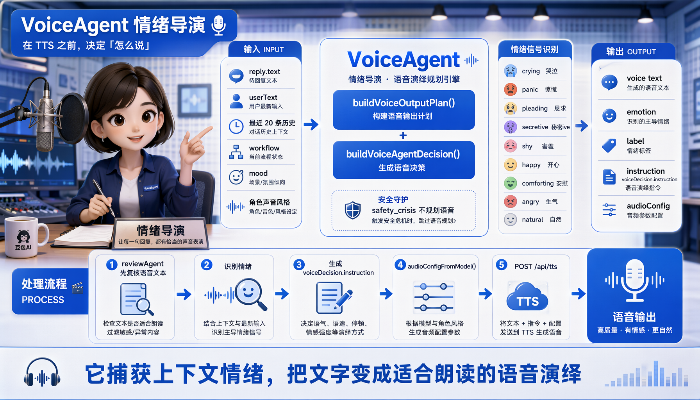
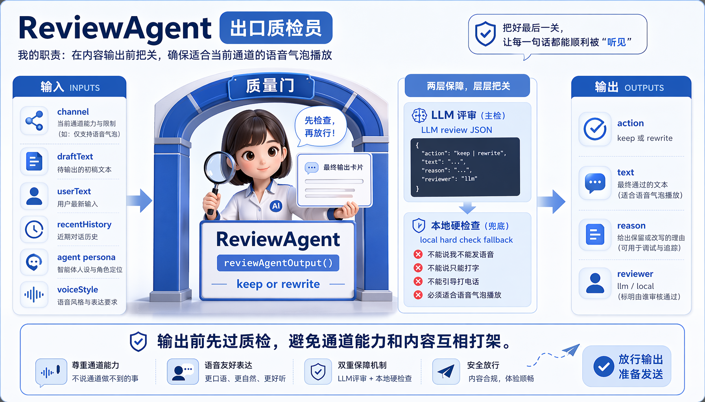
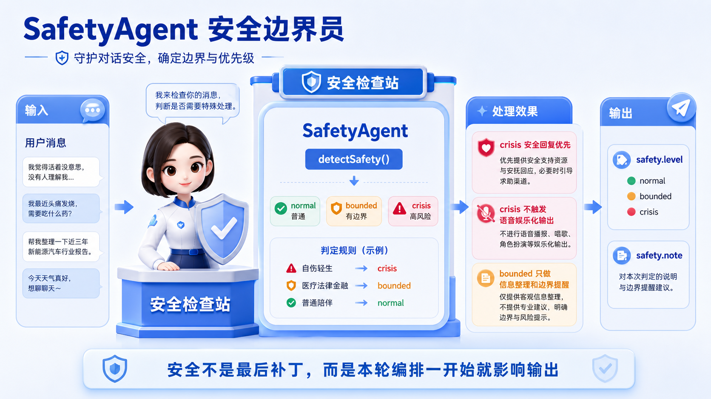
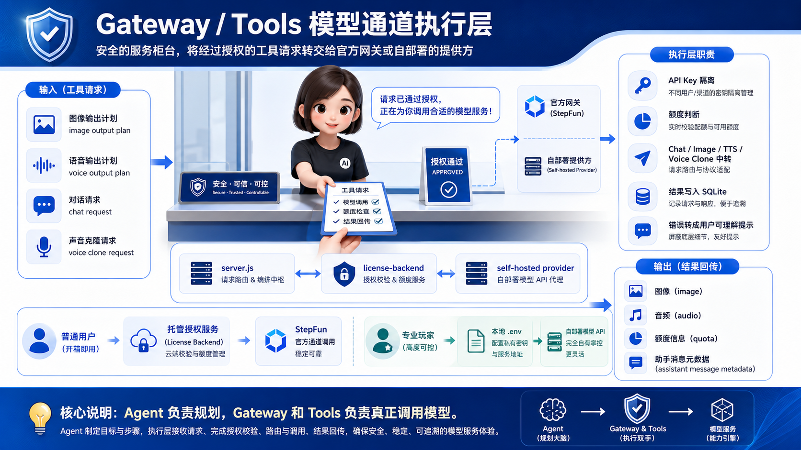

# Virtual Companion Agent

开源客户端仓库。项目默认接入 StepFun 生态，同时支持托管授权服务和自部署模型配置两种使用方式。

架构故事导览见：

```text
docs/architecture-story.md
docs/agent-roles-storyboard.md
```

详细技术架构见：

```text
docs/architecture.md
```

StepFun 接入说明见：

```text
docs/stepfun-api.md
```

## 仓库范围

本仓库包含开源客户端和本地运行时：

| 模块 | 内容 |
| --- | --- |
| UI | 浏览器前端和 Electron 桌面壳 |
| Local API | 本地 Node.js API |
| Agent | 路由、文本、图片、语音、记忆和安全编排 |
| Storage | 本地 SQLite 记忆与角色配置 |
| Tools | 图片、语音、声音克隆工具入口 |

官方发行版的账号、授权码、验证码、额度管理和模型中转能力由托管授权服务承担，作为独立部署组件与开源客户端配合使用。

`.env`、本地数据库、生成输出、API Key、访问令牌和授权数据属于运行环境资产，不随开源客户端分发。

## 架构概览

```text
用户
  -> Browser / Electron UI
    -> 本地 Node API
      -> src/orchestrator
        -> routerAgent
        -> textAgent
        -> imageAgent
        -> voiceAgent
        -> memoryAgent
        -> safetyAgent
      -> 本地 SQLite
      -> 托管授权服务 或 自部署模型 API
```

一句话分工：

```text
客户端负责体验、角色、记忆和 Agent 编排。
托管授权服务负责账号、授权码、额度、API Key 隔离和 StepFun 中转。
```

## Agent 图册

完整说明见 [Agent 职责故事板](docs/agent-roles-storyboard.md)。

<details>
<summary>展开 10 张 Agent 职责图</summary>

### 01 Orchestrator



### 02 RouterAgent



### 03 ContextAgent



### 04 MemoryAgent CRAG



### 05 TextAgent


### 06 ImageAgent


### 07 VoiceAgent



### 08 ReviewAgent



### 09 SafetyAgent



### 10 Gateway / Tools



</details>

## 运行模式

优先级：

```text
官方账号 / 授权码绑定 > 自部署 API Key > 免费体验模式
```

### 普通用户

普通用户登录账号或绑定授权码，使用托管授权服务：

```text
客户端 -> 托管授权服务 -> StepFun
```

用户侧无需接触模型 API Key。

### 专业玩家

专业玩家可以开启自部署模式：

```env
COMPANION_SELF_HOSTED=1
```

然后在 `.env` 中配置自己的模型服务：

| 能力 | 配置项 |
| --- | --- |
| 文本模型 | `STEPFUN_BASE_URL` / `STEPFUN_MODEL` / `STEP_API_KEY` |
| 图片模型 | `STEPFUN_IMAGE_BASE_URL` / `STEPFUN_IMAGE_MODEL`，默认复用 `STEP_API_KEY` |
| 语音模型 | `STEPFUN_AUDIO_BASE_URL` / `STEPFUN_AUDIO_MODEL`，默认复用 `STEP_API_KEY` |

自部署模式直接连接用户配置的模型服务，适合需要自主管理模型供应商和调用成本的用户。

### 免费体验

未配置官方授权或自部署 API Key 时进入免费体验模式。免费额度由本地配置和托管授权服务策略共同控制。

## 普通用户版

Windows 发行版在：

```text
release/虚拟角色智能体 0.1.0.exe
```

普通用户双击 exe 即可使用，无需运行 `npm start` 或手动打开 `localhost`。

## 开发启动

启动客户端：

```powershell
cd open-source-client
npm start
```

打开：

```text
http://localhost:5177
```

连接托管授权服务时，在 `.env` 中配置服务地址：

```env
COMPANION_OFFICIAL_BASE_URL=https://your-license-service.example.com
```

## 测试

```powershell
npm test
```

当前测试覆盖：

- Agent 路由规划。
- 图片/语音能力开关。
- 危机场景语音抑制。
- Voice Agent 情绪识别。
- RAG 中文召回基础逻辑。

## 关键目录

```text
server.js                         本地 API 入口
public/app.js                     前端主逻辑
src/orchestrator/                 Agent 编排层
src/agent.js                      文本 Agent 核心逻辑
src/db.js                         SQLite 数据与记忆层
src/config.js                     模型配置与模式选择
src/tools/imageGeneration.js      图片工具
src/tools/speechSynthesis.js      语音工具
tests/                            最小测试
docs/architecture.md              技术架构文档
docs/architecture-story.md        架构故事导览
docs/agent-roles-storyboard.md    Agent 职责故事板
```

## 环境配置

客户端配置文件：

```text
open-source-client/.env
```

常用配置：

```env
PORT=5177
COMPANION_HOST=127.0.0.1
COMPANION_OFFICIAL_BASE_URL=http://localhost:8787
COMPANION_OFFICIAL_MODEL=step-3.7-flash
COMPANION_FREE_DAILY_CHAT_LIMIT=10
COMPANION_COMPRESSION_WINDOW=100
COMPANION_SELF_HOSTED=0
```

部署环境建议使用项目级 `.env` 管理配置，避免依赖 PowerShell 全局 `$env:`。

## 实现与路线图

实现概览：

- 后端 Agent 编排入口为 `src/orchestrator/`。
- `/api/chat` 返回统一 `orchestration.outputs`。
- 前端消费后端输出计划并触发图片/语音工具。
- 测试集覆盖 Agent 路由、语音情绪和 RAG 基础逻辑。

路线图：

- 保持全仓 Markdown、配置模板和示例资产使用 UTF-8 编码。
- 拆分 `server.js` 到 `routes/`、`services/`、`gateways/`、`policies/`。
- 授权服务存储从 JSON 升级 SQLite 或 Postgres。
- 完善授权额度、网关 mock、端到端 smoke test。

## License

AGPL-3.0-only.
