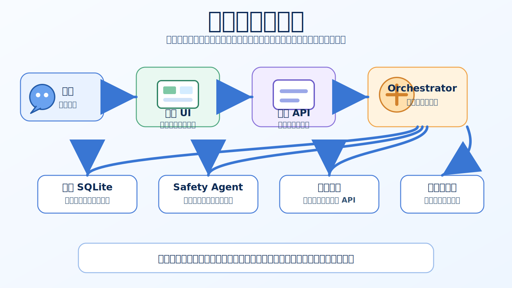
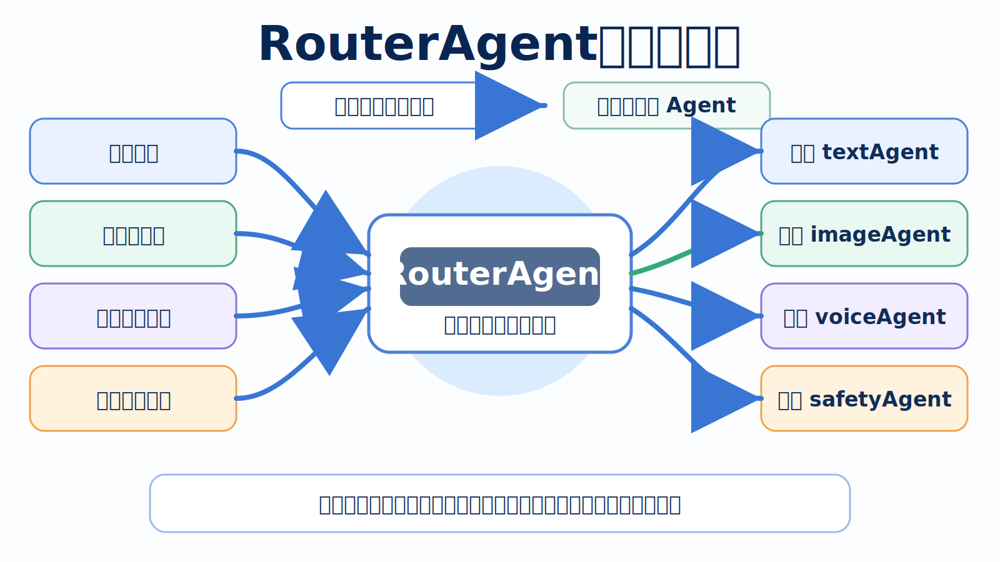
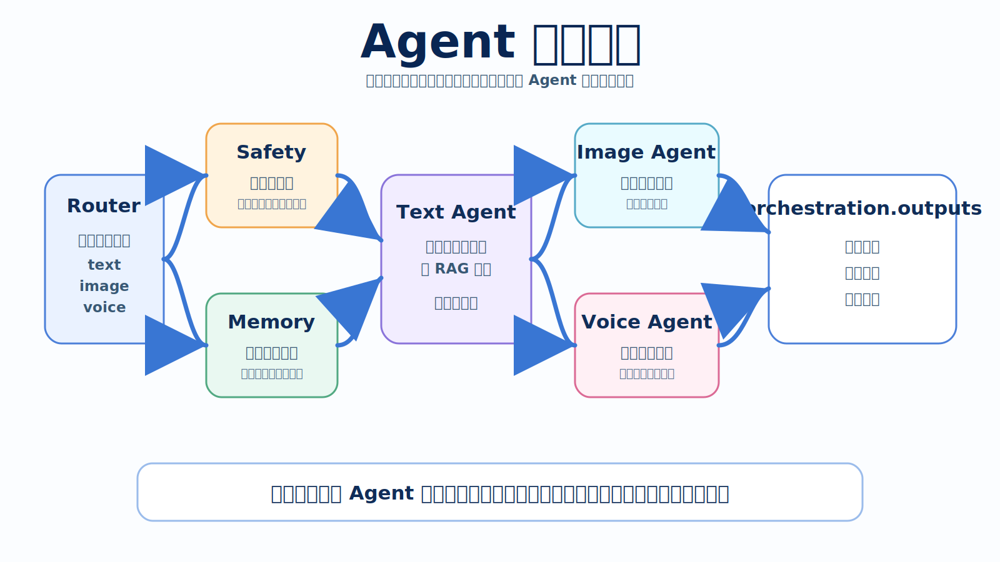
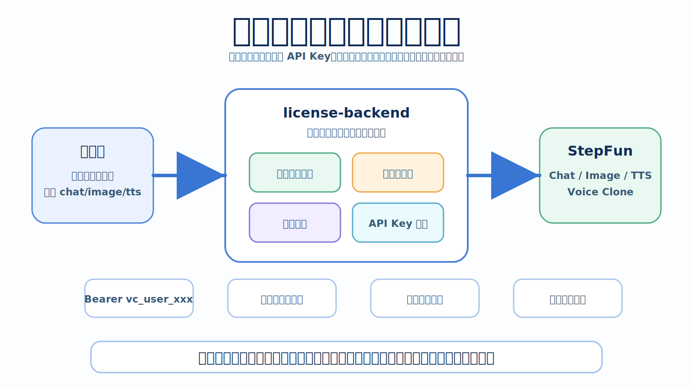
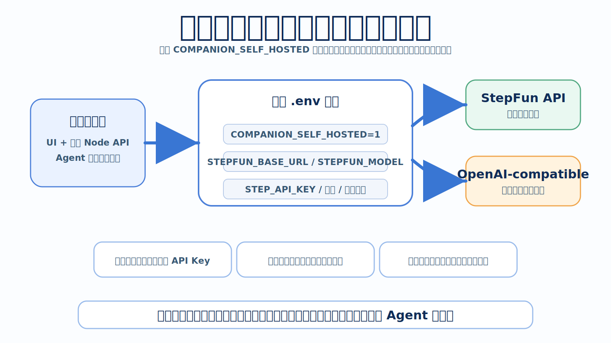

# 架构故事导览

这是一份面向开源读者的架构导览。它不从模块清单开始，而是从一次典型使用开始：用户说了一句话，系统如何理解、分流、调用工具、保存记忆，并把结果送回界面。

更完整的接口、配置和部署细节见 [技术架构与 Agent 编排](architecture.md)。

## 1. 一条消息的旅程



用户在浏览器或桌面端说出一句话。前端只负责把这句话展示出来、提交给本地 API，并等待后端返回结构化结果。

本地 Node API 接住请求后，会把本轮聊天交给 `src/orchestrator/`。编排层读取角色、人设、历史消息、长期记忆和模型配置，再决定这一轮需要文字、图片、语音，还是只需要安全回复。

这条链路的重点是分层：前端负责体验，本地后端负责编排，托管授权服务或自部署模型服务负责模型调用。

## 2. RouterAgent：总调度员



RouterAgent 像一次对话回合里的总调度员。它不会自己生成最终内容，而是先判断“这是什么事”：

- 普通聊天交给 `textAgent`。
- 图片意图交给 `imageAgent` 生成图片工具计划。
- 语音意图交给 `voiceAgent` 生成朗读文本、音色和情绪指令。
- 危机场景或高风险表达交给 `safetyAgent` 约束输出。

这样做的好处是，核心判断集中在后端，前端不再承担 prompt 路由和多 Agent 决策。

## 3. Agent 小队接力



一次回复通常不是一个 Agent 单独完成，而是一支小队接力完成：

- `safetyAgent` 先识别风险边界，危机表达优先进入安全回复。
- `memoryAgent` 负责召回相关长期记忆，并规划本轮是否需要写入新记忆。
- `textAgent` 结合角色设定、历史消息、RAG 召回和安全边界生成主回复。
- `imageAgent` 从文本语义和角色上下文中整理图片生成计划。
- `voiceAgent` 捕获语气和情绪，把文本转换成适合 TTS 的演绎指令。

最终这些结果会汇成统一的 `orchestration.outputs`。前端只消费这个输出计划，再按计划渲染文字、触发图片生成或播放语音。

## 4. 托管授权服务：守门与中转



普通用户使用官方账号或授权码时，模型调用会经过托管授权服务。它承担四件事：

- 账号与授权码校验。
- 免费额度和授权额度统计。
- StepFun API Key 隔离。
- Chat、Image、TTS、Voice Clone 的统一中转。

客户端只保存用户访问令牌，不保存 StepFun API Key。授权服务校验身份和额度后，把请求转发给 StepFun，并在成功后记录用量。

## 5. 自部署模式：专业玩家的直连通道



项目也保留自部署模式。专业用户可以在本地 `.env` 中开启：

```env
COMPANION_SELF_HOSTED=1
```

开启后，客户端会直接连接用户配置的 OpenAI-compatible 或 StepFun API。此时模型供应商、API Key、调用成本和稳定性由用户自行管理，客户端仍然负责本地体验、角色、记忆和 Agent 编排。

## 6. 一句话总结

```text
前端负责展示。
本地后端负责 Agent 编排、记忆和工具计划。
托管授权服务负责账号、额度、API Key 隔离和模型中转。
自部署模式给专业用户保留直连模型服务的能力。
```

这套结构让项目既能面向普通用户提供开箱即用的体验，也能给开发者和专业玩家留下清晰、可扩展的技术入口。
